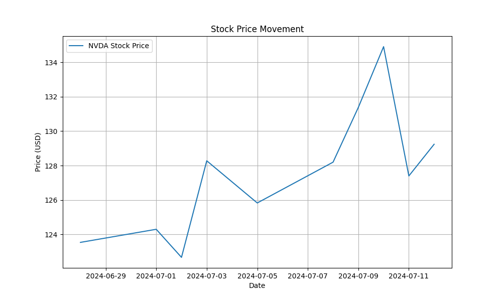

**Company Overview**

Microsoft Corporation (MSFT) is an American multinational technology company that produces computer software, consumer electronics, personal computers, and related services. The company operates through three business segments: Productivity and Business Processes, Intelligent Cloud, and More Personal Computing. MSFT is a leading player in the technology industry, with a diverse range of products and services including Windows operating system, Office software, Azure cloud computing platform, and Xbox gaming console.

**Company Financial Performance & Valuation & Comparison with Competitors**

MSFT has a market capitalization of $3.37 trillion, with an EBITDA of $125.98 billion and a PE ratio of 39.37. The company has a strong profit margin of 36.4% and an operating margin of 44.6%. Its return on assets and equity are 15.4% and 38.5%, respectively. The company has a dividend yield of 0.66% and a payout ratio of 25.4%.

The top competitor of MSFT is Apple Inc. (AAPL). Here is a comparison of the two companies:

| Metric | MSFT | AAPL |
| --- | --- | --- |
| Market Capitalization | $3.37 trillion | $3.535 trillion |
| EBITDA | $125.98 billion | $129.63 billion |
| PE Ratio | 39.37 | 35.85 |
| Profit Margin | 36.4% | 26.3% |
| Operating Margin | 44.6% | 30.7% |
| Return on Assets | 15.4% | 22.1% |
| Return on Equity | 38.5% | 147.2% |
| Dividend Yield | 0.66% | 0.43% |
| Payout Ratio | 25.4% | 24.5% |

MSFT's strong financial performance is driven by its diversified product portfolio and strong market position. The company's high profit margin and operating margin indicate that it is efficiently managing its operations and generating profits.

**Recent Market News Analysis & Stock Price Trend & Technical Indicator**

Recent market news about MSFT includes:

* OpenAI's Q* gets a new name, Project Strawberry, which could be a positive development for MSFT.
* Analysts are maintaining a positive outlook on MSFT, with some raising their price targets.
* MSFT is investing in a UAE AI firm, which could be a strategic move for the company.

These news items could be contributing to the recent upward trend in the stock price. The stock price chart of MSFT shows a steady upward trend over the past few weeks, with some minor fluctuations. The recent high was around $467, and the current price is around $453. The MACD indicator is above the signal line, indicating a bullish trend. The RSI is around 54, indicating a neutral trend.

**Stock Price Graph**

**How the Recent Macro Industry and Economy View Would Affect Company**

The current macro industry situation is likely to have a positive influence on MSFT, driven by the turnaround in the technology sector and the growing demand for digital transformation IT services. MSFT's strong market position and diversified product portfolio will help it capitalize on these trends and navigate any challenges that may arise.

**Recommendation & Trading or Investment Strategy**

Based on the analysis, a potential trading strategy could be:

* Target Buy Price: $448 (around the 20-day EMA)
* Target Sell Price: $465 (around the recent high)

Investors may consider a long-term investment strategy in MSFT, taking advantage of its strong fundamentals and growth prospects. However, they should also consider diversifying their portfolio to minimize risk. A dividend reinvestment strategy may also be suitable for MSFT, given its relatively low dividend yield.

**Risk**

The company's high PE ratio may indicate that the stock is overvalued. Additionally, the investment in the UAE AI firm has raised some concerns among Republican lawmakers, which could be a potential negative factor. Investors should also be aware of the potential risks associated with the recommended trading or investment strategy, including market volatility and potential losses.

**Forecast**

Based on the above factors, I predict that MSFT's stock price will likely increase by 1-2% during the upcoming week (July 14-21). The company's strong financial performance and growth potential are positive signs for investors, which could outweigh any concerns about regulatory issues or increased competition in the gaming industry.
